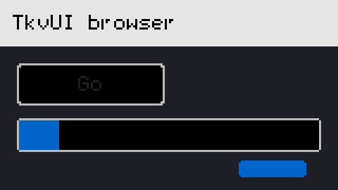
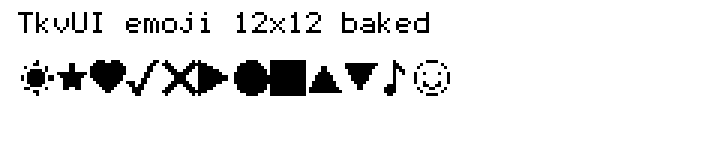

# TokenVector.UI (TkvUI)


Thư viện UI đa nền tảng viết **100% bằng TokenVector (`.tkv`)** — không phụ thuộc runtime bên thứ ba (không Skia, SDL, WPF, hay Qt).

Rasterizer, font, hiệu ứng, layout, widget, persist (SQLite), trình ghi PDF và codec media đều nằm trong repo này, biên dịch bằng `tkvc.exe` → CIL/.NET IL → `.exe`.

[English](README.md) | Tiếng Việt

## Điểm nổi bật

| Hạng mục | Trạng thái (2026-09-24) |
|---|---|
| **Phiên bản** | **1.0.1** (`tkvui_version()` trong `TokenVector.UI.tkv`) |
| **Verify** | **55 PASS / 0 FAIL / 2 SKIPPED** (`TKVUI_VERIFY_OK`, 57 case; Android/iOS cần thiết bị thật) |
| **Số assert** | **~2200+** checks trong suite |
| **Catalog widget** | **93 constructors** — Widgets 42 + Native 41 + Media 10 (`WIDGETS_BREADTH_OK` 15/15) |
| **Dung lượng** | Suite exe ~1644 KB · app ~549 KB–3.3 MB (tùy asset bake) |
| **Khởi động / RAM** | Cold ~1.0 s · idle ~11 MB · load-text peak ~46 MB |
| **Vẽ text** | **9.4 ms / 21.6K ký tự** (≈ nhanh hơn PyQt6 ~1.9× cùng workload) |
| **Paint widget** | **~30 ms / 1000 nút** (PyQt6 ≈ 43 ms) |
| **SQL (file RT)** | **~81 ms / 1000 dòng** vs PyQt6 QSQLITE ~195 ms (≈2.4×) |
| **Chữ tiếng Việt** | 134 glyph precomposed · IME Telex/VNI **37/37** |
| **Persist / in ấn** | SQLite built-in **132/132** · PDF writer **63/63** |
| **License** | **MIT** |

### Điều làm dự án này khác biệt

- **Một stack một ngôn ngữ:** UI, raster, text, SQL, PDF, codec GIF/MJPEG/MP4/TKVV — tất cả `.tkv`.
- **Vietnamese-first typography:** 134 dấu precomposed + UTF-8 sequence-aware + bộ gõ Telex/VNI.
- **Wire HarfBuzz optional:** đường vẽ shaped khi có `libharfbuzz.dll`; thiếu DLL → skip sạch.
- **Port Qt (chứng minh headless):** `QtAppPort` **52/52**, `QtTreeDockPort` **31/31**.
- **Đường video custom:** TKVV fast-path ~**100 fps @ 720p** (software); MJPEG baseline ~106 fps @ 160×120.
- **WASM:** đường interpreter chạy thật (wasmtime `DATA_OK`); demo canvas browser; AOT đóng ở upstream.
- **A11y:** cây a11y + UIA/AT-SPI host-driven + KitTest 16/16; NVDA vẫn cần UIA provider thật (L7).

## Ảnh chụp (render 100% bằng TkvUI — không mock)

| BrowserDemo (160×90, phóng 3×) | Dải emoji bake (240×48, phóng 3×) |
|---|---|
|  |  |

Khung browser: title + nút `Go` + progress + slider theo frame (`examples/TkvUI.BrowserDemo.tkv` → base64 RGBA → PNG).  
Dải emoji: 12 BMP symbol bake offline từ Segoe UI Symbol (`tools/emoji_gen.py` → `TkvUI.EmojiData.tkv`), vẽ qua `fb_draw_run_emoji`.

## Bắt đầu nhanh

```bash
# 1) Build + chạy toàn bộ selftest headless (không mở cửa sổ)
TKVC=/d/TokenVector/3.code/dist/tkvc.exe bash tools/verify.sh
# -> TKVUI_VERIFY_OK  (55 PASS / 0 FAIL / 2 SKIPPED)

# 2) Build một module
$TKVC build TkvUI.Layout.tkv --entry layout_selftest --out build/layout_test.exe && build/layout_test.exe

# 3) Build suite umbrella (entry mặc định `main`)
$TKVC build TokenVector.UI.tkv --out build/tkvui_suite.exe && build/tkvui_suite.exe   # -> TKVUI_OK

# 4) Demo cửa sổ Win32 thật (UpdateLayeredWindow; mở console; ESC để thoát)
$TKVC build examples/TkvUI.Demo.tkv --entry run      --out build/TkvUI.Demo.exe    && build/TkvUI.Demo.exe
$TKVC build examples/TkvUI.Live.tkv --entry run_live --out build/TkvUI.LiveRun.exe && build/TkvUI.LiveRun.exe
```

`tkvc.exe` mặc định tìm ở `D:\TokenVector\3.code\dist\tkvc.exe`; đặt `TKVC` nếu ở chỗ khác.

## Cấu trúc repo

| Đường dẫn | Nội dung |
|---|---|
| `TkvUI.Core.tkv` | `ColorRgba`/`ColorHsla`, `Point2D`, `Rect2D`, `Matrix3x2`, `PixelSurface` (`list[i64]`), theme token, insets, DPI, surface pool |
| `TkvUI.Graphics.tkv` | Line Bresenham, round-rect fill/stroke, arc, polyline, clip, blit image |
| `TkvUI.Text.tkv` | Font bitmap 5×7 (95 ASCII + **134 tiếng Việt precomposed**), glyph atlas pre-baked, measure/draw/wrap/ellipsis, TTF parser/rasterizer đã verify, `text_atlas_draw_shaped` (wire HarfBuzz) |
| `TkvUI.Viet.tkv` | Glyph tiếng Việt + helper UTF-8 sequence-aware |
| `TkvUI.HarfBuzz.tkv` | Leaf FFI optional cho `libharfbuzz.dll`; thiếu DLL → skip sạch |
| `TkvUI.Effects.tkv` | Box blur, half-res blur (~2.1×), Kawase, backdrop blur, specular, drop shadow |
| `TkvUI.Platform.tkv` | Probe nền tảng runtime, Win32 thật (ULW+DIB), stub X11/Cocoa, contract Android/iOS, WinForms interop, IME Win32 |
| `TkvUI.Events.tkv` / `TkvUI.Input.tkv` | Event args, hit-test topmost, dispatcher + capture, gesture cảm ứng |
| `TkvUI.Layout.tkv` | Flex (wrap/cross/justify), grid+span, stack, validator DPI — **50/50** |
| `TkvUI.Widgets.tkv` | `UIElement` + **42 widget** (base, Ant-inspired, Wave A breadth), spring/tween, invalidation, frame scheduler, focus |
| `TkvUI.Widgets.Native.tkv` | **41 widget native-look** (button…tree multi-sel, dock float/tab, MDI tile, ribbon, property grid, context menu, …) — **255/255** |
| `TkvUI.Media.tkv` | **10 widget media player** (transport, seek, volume, playlist, EQ, spectrum, A-B loop, …) |
| `TkvUI.Data.tkv` | Model/view/delegate + proxy sort/filter — **76/76** |
| `TkvUI.SQLite.tkv` | SQL engine thuần `.tkv` (CRUD, snapshot tx, dual-slot file, crash matrix) — **132/132** |
| `TkvUI.Printing.tkv` | PDF writer thuần `.tkv` + shell print — **63/63** |
| `TkvUI.Bidi.tkv` / `TkvUI.Shaping.tkv` | Bidi UAX#9 **194/194** · shaping phức tạp **91/91** |
| `TkvUI.Video*.tkv` / `TkvUI.Tkvv*.tkv` / `TkvUI.Mjpg*.tkv` / `TkvUI.Mp4*.tkv` | GIF, TKVV, MJPEG, demux MP4 thuần `.tkv` |
| `TkvUI.A11y*.tkv` / `TkvUI.Uia.tkv` / `TkvUI.Atspi.tkv` / `TkvUI.KitTest.tkv` | Mô hình a11y, bridge, test GUI kiểu kittest |
| `TokenVector.UI.tkv` | Umbrella: import suite và chạy `main()` |
| `tkvui.pkg.json` | Manifest gói (version, modules, selftests, nền tảng) |
| `tools/verify.sh` | Một lệnh build + chạy headless mọi case |
| `tools/package.sh` / `tools/pack_nupkg.ps1` | Đóng gói `.tkvpkg` + `.nupkg` |
| `docs/` | Roadmap, API, bench, ma trận đối thủ, ràng buộc compiler |
| `examples/` | Demo, benchmark, port Qt, fuzz, designer, clip player |

Example tiêu biểu: `Demo`, `Live` (60 fps), `MediaDemo`, `CrudDemo`, `BrowserDemo`, `VideoDemo`, **`QtAppPort` (52/52)**, **`QtTreeDockPort` (31/31)**, `ClipPlayer` (14/14), `Designer`/`DesignerApp`, `Fuzz`, `AndroidDemo`/`IOSDemo` (gated theo thiết bị).

## Kết quả verify (2026-09-24 — `TKVUI_VERIFY_OK`: 55 PASS / 0 FAIL / 2 SKIPPED)

| Nhóm | Kết quả |
|---|---|
| `core_selftest` | 47/47 |
| `graphics_selftest` | 29/29 |
| `text_selftest` | **239/239** (atlas + tiếng Việt + TTF synthetic + i18n bake + fallback) |
| `effects_selftest` | 32/32 |
| `platform_selftest` | **82/82** (probe runtime + WinForms interop + multi-window) |
| `input_selftest` | 41/41 |
| `layout_selftest` | 50/50 |
| `widget_selftest` | **167/167** |
| `widgets_breadth_selftest` | **15/15 `WIDGETS_BREADTH_OK`** — catalog **93** |
| `media_selftest` | 80/80 |
| `bidi_selftest` | **194/194** |
| `harfbuzz_selftest` / `hbwire_selftest` | **`HBWIRE_OK`** (skip sạch khi thiếu DLL) |
| `gpu_selftest` | 66/66 (abstraction + probe; present vẫn ULW/CPU) |
| `a11y_selftest` | 41/41 |
| `theme_selftest` | 79/79 |
| `native_selftest` | **255/255** (41 widget native-look hậu Wave B) |
| `data_selftest` | 76/76 |
| `sqlite_selftest` | 132/132 (+ crash matrix + kill-9) |
| `printing_selftest` | 63/63 |
| `abridge_selftest` | 94/94 |
| `fallback_selftest` | 37/37 |
| `emoji_selftest` | 107/107 |
| `fontdisc_selftest` | 18/18 |
| `clipboard_selftest` | 12/12 (round-trip Win32 ASCII/Việt/emoji) |
| `shaping_selftest` | 91/91 (Arabic/Thai/Indic/Bengali/Tamil) |
| `nativedlg_selftest` | 39/39 |
| `ime_selftest` | 37/37 (Telex/VNI) |
| `uia_selftest` / `atspi_selftest` | 33/33 + 22/22 |
| `kittest_selftest` | 16/16 |
| `video_selftest` (GIF) | 44/44 |
| `tkvv_selftest` | 56/56 |
| `mjpg_selftest` / `mjpg_hd_selftest` | 44/44 + 6/6 |
| `mp4_selftest` | 62/62 |
| `videodemo_run` | 21/21 |
| `qtapp_run` | **52/52 `QTAPP_OK`** |
| `qttd_run` | **31/31 `QTDOCK_OK`** |
| `clipplayer_run` | 14/14 |
| `suite` (`TokenVector.UI.tkv`) | `TKVUI_OK` |
| `Live` / `DemoMobile` / `MediaDemo` | `TKVUI_LIVE_OK` / `TKVUI_MOBILE_OK` / `TKVUI_MEDIA_DEMO_OK` |
| `AndroidDemo` / `IOSDemo` | `*_SKIPPED` trên Windows (cần thiết bị thật) |

Chạy lại:

```bash
TKVC=/path/to/tkvc.exe bash tools/verify.sh
```

## Hỗ trợ nền tảng

| Backend | Trạng thái | Ghi chú |
|---|---|---|
| **Win32** | **Production** | `CreateWindowExW` + `WS_EX_LAYERED`, `CreateDIBSection`, `UpdateLayeredWindow` |
| X11 | Stub | Chờ `tkvc` cho phép pinvoke `libX11.so` (linter hiện bắt buộc hậu tố `.dll`) |
| Wayland | Chưa có | Cùng ràng buộc `.so` |
| Cocoa / macOS | Stub | Dùng WinForms vehicle (`wf_*`) khi cần cửa sổ thật |
| Android | Contract host-driven | Host cấp JNI env + buffer ARGB native |
| iOS | Contract host-driven | Host cấp buffer RGBA; host upload pixel |

`detect_platform()` trả `1=Win32, 2=X11, 3=Wayland, 4=Cocoa, 5=Android, 6=iOS` qua probe runtime; ép bằng `TKVUI_PLATFORM=1..6` khi test.

## Benchmark (chuẩn hoá đối đầu — xem `docs/BENCH.md`)

| Workload | TkvUI | PyQt6 / Qt 6.11 | Tỷ |
|---|---|---|---|
| Text 21.6K ký tự/block | **9.4 ms** | 13.7–18.1 ms | **~1.9× nhanh hơn** |
| Construct 1000 nút | **< 0.16 ms** | 12.6 ms | thắng (timer floor) |
| Paint 1000 nút | **~30 ms** | ~43 ms | **~1.4× nhanh hơn** |
| CRUD in-memory total/rep | **~8 ms** | ~14 ms | **~1.8× nhanh hơn** |
| SQL file round-trip 1000 dòng | **~81 ms** | ~195 ms | **~2.4× nhanh hơn** |
| Idle memory (app trivial) | **~11 MB** | 15.6 MB | **nhỏ hơn** |
| Cold start | **~1.0 s** | ~0.2 s | **chậm hơn (L3 / NGEN)** |
| Load-text peak memory | ~46 MB | 15.6 MB | **lớn hơn** |

Lưu ý timer: TkvUI dùng `GetTickCount` (quantum ~16 ms); PyQt dùng `perf_counter` (µs). Gate: `BENCH_STABLE_OK` (median 3 lần chạy).

Số liệu Slint / egui / Dear ImGui **chưa** đo lại trên máy này — so sánh theo docs công khai + gap ghi rõ ở `docs/COMPETITORS.md` §9.

## Đóng gói release

```bash
# 1) Source package (.tkvpkg = zip + checksum)
bash tools/package.sh --verify
# -> dist/TokenVector.UI-<version>.tkvpkg (+ .sha256)
#    PKG_VERIFY_OK = suite build + chạy OK từ bản giải nén

# 2) NuGet package + DLL
powershell -ExecutionPolicy Bypass -File tools/pack_nupkg.ps1
# -> dist/TokenVector.UI.<version>.nupkg
```

App khác giải nén `.tkvpkg` rồi `__tkv_import__ = ["TokenVector.UI"]`, hoặc tham chiếu NuGet (source ở `tkv/`, optional `TokenVector.UI.dll`). Hướng dẫn: `docs/INTEGRATION.md`.

## Giới hạn đã biết

- **Đa nền tảng:** chỉ Windows production-ready; X11/Cocoa là stub (gap pinvoke `.so` của compiler).
- **Text:** shaping HarfBuzz đầy đủ cần `libharfbuzz.dll`; thiếu thì skip sạch. Emoji màu/non-BMP và hinting chưa làm.
- **GPU:** có abstraction + probe; present vẫn CPU/ULW (roadmap L4).
- **Cold start ~1.0 s:** JIT .NET + AV; lever là NGEN/AOT (roadmap L3).
- **A11y:** model + bridge + test đã có, nhưng NVDA chưa đọc được widget custom (cần UIA provider thật — L7).
- **Media:** H.264 Baseline qua shim OpenH264 optional; Main/High + audio clock cần FFmpeg/WASAPI (L6).
- **WinForms:** interop cấp window thật; control-level còn stub (compiler gap).
- **Demo** mở kèm console (`tkvc`/`ilasm` subsystem CUI).
- **Trước khi sửa `.tkv`:** đọc `docs/TkvUI.Roadmap.md` §0 (ràng buộc compiler: không `bool`, không bitwise, không nested attribute, record không chứa `list`, quirk list-append D1, …).

## Tài liệu

| Tài liệu | Mục đích |
|---|---|
| `docs/LEVEL_PLAN.md` | Kế hoạch san bằng L1–L10 vs đối thủ |
| `docs/COMPETITORS.md` | Ma trận đối thủ chi tiết (§9 = 25 mục) |
| `docs/BENCH.md` | Benchmark chuẩn hoá đối đầu |
| `docs/API.md` | Index module / hàm |
| `docs/TkvUI.Roadmap.md` | Roadmap v2/v3 + **§0 ràng buộc compiler** |
| `docs/INTEGRATION.md` | App khác import TkvUI thế nào |
| `docs/COMPILER_GAPS.md` | Gap `tkvc` đã biết + workaround |
| `CHANGELOG.md` | Lịch sử phát hành |
| `DEVELOPMENT_PLAN.md` | Kế hoạch v3 hướng parity |

## License

MIT — xem [`LICENSE`](LICENSE).
